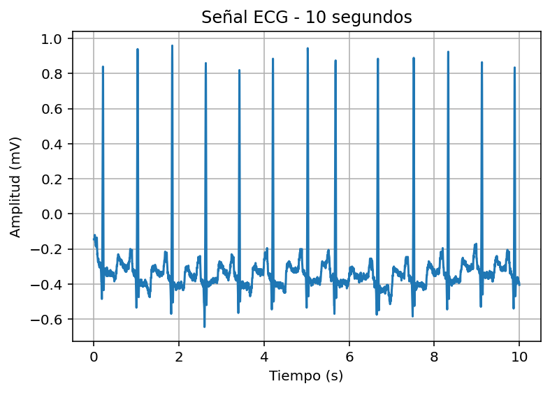
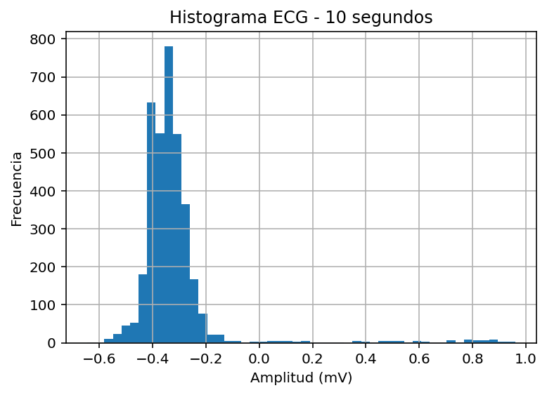

# Laboratorio 1  
## Análisis Estadístico de Señales Biomédicas  

**Programa:** Ingeniería Biomédica  
**Asignatura:** Procesamiento Digital de Señales  
**Universidad:** Universidad Militar Nueva Granada  
**Estudiantes:** Danna Rivera, Duvan Paez

---
# Parte A
## Base de datos utilizada

Se empleó el registro **100** de la base de datos **MIT-BIH Arrhythmia Database**, disponible en:

PhysioNet  
https://physionet.org/

La señal analizada corresponde a un **Electrocardiograma (ECG)**.


## Procedimiento

### 1. Carga de la señal

Se utilizó la función `rdrecord()` de la librería `wfdb` para cargar el registro 100.  
Se extrajo el canal 0 de la señal y la frecuencia de muestreo correspondiente.

Se construyó un vector de tiempo a partir del número de muestras y la frecuencia de muestreo.

### 2. Visualización de la señal

Se graficaron los primeros 10 segundos de la señal ECG con el fin de observar de manera mas precisa y clara, la forma de la señal, permitiendo visualizar mejor sus complejos.

#### Señal ECG (10 segundos)



---

### 3. Cálculo de parámetros estadísticos

Se calcularon los siguientes estadísticos descriptivos:

- Media  
- Varianza  
- Desviación estándar  
- Coeficiente de variación  
- Asimetría (Skewness)  
- Curtosis  

#### Método 1: Implementación manual

Se programaron directamente las fórmulas matemáticas para cada parámetro, utilizando operaciones básicas y estructuras de cálculo explícitas.

## 1. Media

La media representa el valor promedio de la señal.

**Fórmula:**
```python
media = sum(signal) / N
```

**Lógica del cálculo:**
- Se suman todas las muestras de la señal.
- Se divide el resultado entre el número total de datos (N).
- Esto permite obtener el valor central de la señal.

---

## 2. Varianza

La varianza mide la dispersión de los datos respecto a la media.

**Fórmula:**
```python
var = sum((signal - media)**2) / N
```

**Lógica del cálculo:**
- Se resta la media a cada muestra (centrado).
- Se eleva cada diferencia al cuadrado para evitar cancelaciones por signo.
- Se promedian esas diferencias cuadráticas.
- El resultado indica qué tan dispersa está la señal.

---

## 3. Desviación estándar

La desviación estándar es la raíz cuadrada de la varianza.

**Fórmula:**
```python
std = np.sqrt(var)
```

**Lógica del cálculo:**
- Devuelve la dispersión a las mismas unidades originales de la señal.
- Permite interpretar la variabilidad de forma más intuitiva.

## 4.Coeficiente de Variación

Mide la variabilidad relativa respecto a la media.

**Fórmula:**
```python
cv = std / media
```

## 5. Estandarización

La estandarización transforma la señal restando la media y dividiendo por la desviación estándar.
**Fórmula:**
```python
z = (signal - media) / std
```

Esta variable `z` es la que se utiliza posteriormente para calcular la asimetría y la curtosis:

```python
skew_manual = sum(z**3) / N
kurt = sum(z**4) / N
```

**Lógica del cálculo:**
- Se resta la media.
- Se divide por la desviación estándar.
- Se obtiene una variable adimensional.
- Permite analizar la forma de la distribución sin depender de la amplitud.


## 6. Asimetría y Curtosis

**Asimetría:**  
**Fórmula:**
```python
skew_manual = sum(((signal - media)/std)**3) / N
```
Evalúa si la distribución está inclinada hacia la derecha o izquierda.

Se calcula elevando al cubo los valores estandarizados.

**Curtosis:**  
**Fórmula:**
```python
kurt = sum(((signal - media)/std)**4) / N
```
Evalúa qué tan pronunciados son los picos de la distribución.

Se calcula elevando a la cuarta potencia los valores estandarizados.


#### Método 2: Funciones predefinidas

Se utilizaron funciones de Python:

- `numpy.mean()`  
- `numpy.std()`  
- `scipy.stats.skew()`  
- `scipy.stats.kurtosis()`  

Posteriormente se calcularon las diferencias absolutas entre ambos métodos para verificar la consistencia de los resultados.


### 4. Histograma

Se construyó el histograma correspondiente a los primeros 10 segundos de la señal ECG, utilizando el mismo segmento previamente graficado en el dominio del tiempo. Esto permitió analizar la distribución de frecuencias de amplitud sobre exactamente la misma muestra de datos, garantizando coherencia en el análisis estadístico.

#### Histograma ECG (10 segundos)




## Comparación de resultados

Las diferencias obtenidas entre los cálculos manuales y los generados por las funciones de Python fueron prácticamente nulas, lo que valida la correcta implementación de las fórmulas matemáticas.


## Archivo principal de lo mencionado (Parte A)

`ParteA.py`

---
# Configuración STM32

## Sistema de adquisición y transmisión de datos

Se utiliza una Blackpill STM32 como sistema de adquisición de datos:
### Hardware:
- Microcontrolador: STM32 Blackpill
- Entrada analógica: Pin A0
- Comunicación USB: USB CDC (Virtual COM Port)

## Funcionamiento general

El sistema realiza el siguiente proceso:
1. Lectura de la señal analógica en el pin A0
2. Conversión analógica-digital mediante el ADC interno del STM32
3. Transferencia automática del dato usando DMA
4. Envío del valor digital (en forma de texto) por USB al computador
5. Recepción de los datos en python mediante un puerto serial virtual (COM)

## Archivo principal 

`PARTEC_LAB1.rar`

Al extraer este archivo se encuentra la carpeta correspondiente al código de C, por lo que se debe buscar en MDK-ARM el archivo de keil, en este se busca: 

`main.c`

El cual contiene:

- Configuración del ADC
- Configuración del DMA
- Configuración USB-CDC
- Rutina de adquisición
- Envío de datos por USB al PC 

## Uso

1. Conectar la señal analógica al pin A0
2. Conectar la Blackpill por USB al computador
3. Cargar el firmware en el STM32
4. Abrir el script Python de adquisición
`ParteB.py`
5. Leer los datos desde el puerto COM
   
---
# Parte B


---
# Parte C

## Análisis de ruido

En esta parte se realiza el análisis de ruido por simulación en software, a partir de una señal real previamente capturada y almacenada en un archivo de texto.
El objetivo es estudiar cómo diferentes tipos de ruido afcetan una señal biomédica y cómo se degrada su calidad.

## Funcionamiento general

El código realiza el siguiente proceso:
1. Carga una señal desde un archivo .txt
2. Genera ruido de forma digital (simulación matemática)
3. Contamina la señal sumando el ruido
4. Calcula la relación señal/ruido (SNR)
5. Analiza estadísticamente la señal
6. Genera gráficas e histogramas
7. Guarda los resultados en archivos

## Archivo principal

`ParteC_simulacion.py`

Este archivo contiene todo el procedimiento previamente visto.

## Entrada de datos

La señal se carga desde un archivo generado previamente (el de la parte B):

`senal_real = np.loadtxt(ARCHIVO_SENAL)`

## Tipos de ruidos

### Ruido gaussiano (ruido blanco)

`media_ruido = 0  
`
`std_ruido = 0.05   # desviación estándar en voltios`
`ruido_gauss = np.random.normal(media_ruido, std_ruido, N)`

Este ruido simula:

- Ruido térmico
- Ruido electrónico del sistema
- Interferencias aleatorias
- Ruido blanco

El parámetro mas importante para controlar la intensidad del ruido es:

`std_ruido = 0.05`

### Ruido impulsivo (picos aleatorios)

`ruido_impulsivo = np.zeros(N)
num_impulsos = int(0.01 * N)  # 1% de muestras con impulsos
indices = np.random.randint(0, N, num_impulsos)
ruido_impulsivo[indices] = np.random.uniform(-1, 1, num_impulsos)`

`num_impulsos = int(0.01 * N)`

### Ruido tipo artefacto (alta frecuencia)

`frecuencia_muscular = 50  # Hz
ruido_muscular = 0.02 * np.sin(2*np.pi*frecuencia_muscular*t)`

`frecuencia_muscular = 50`


## Contaminación de la señal 

La contaminación se realiza digitalmente mediante suma directa:

`senal_gauss = senal_real_v + ruido_gauss
senal_impulsiva = senal_real_v + ruido_impulsivo
senal_muscular = senal_real_v + ruido_muscular`

Esto permite simular el efecto del ruido sobre la señal sin necesidad de hardware.
